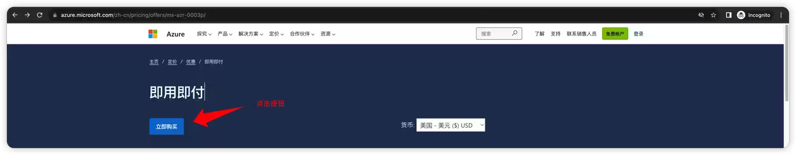
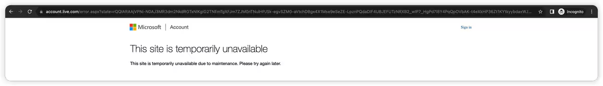
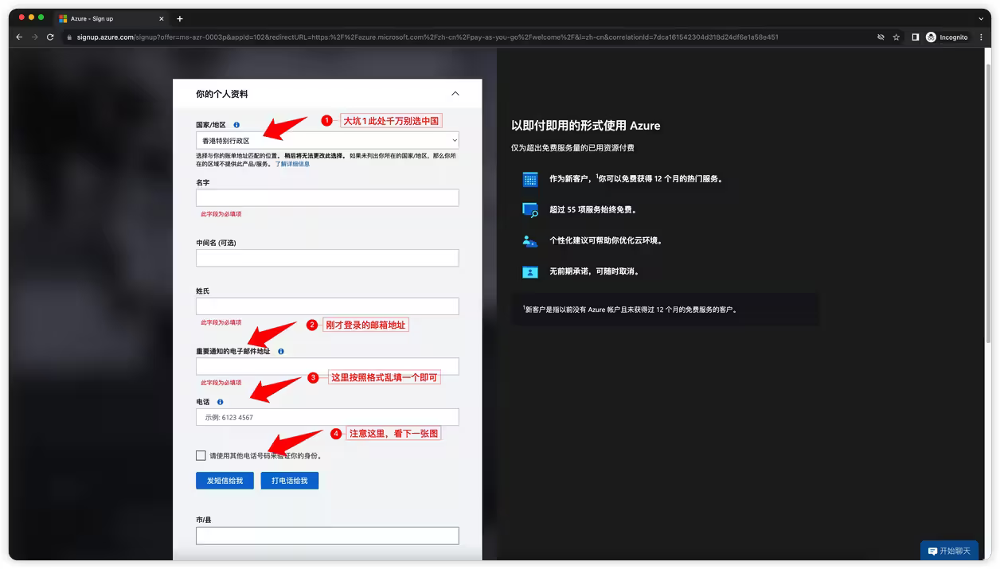
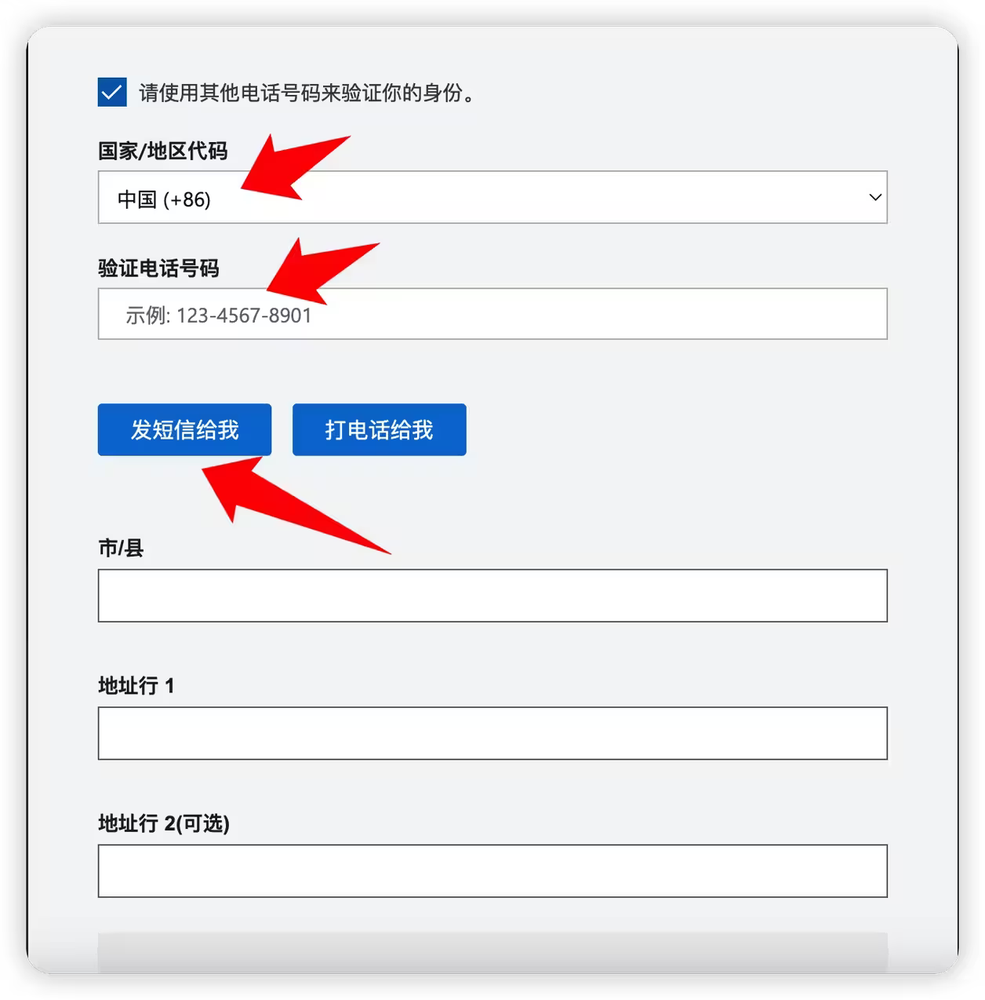
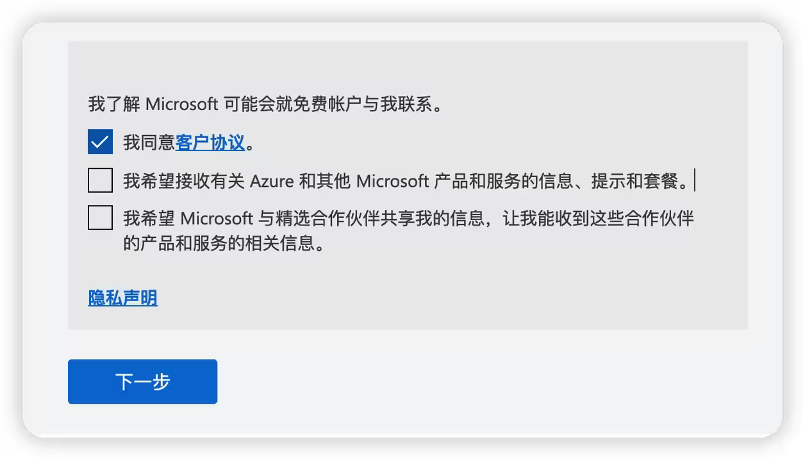
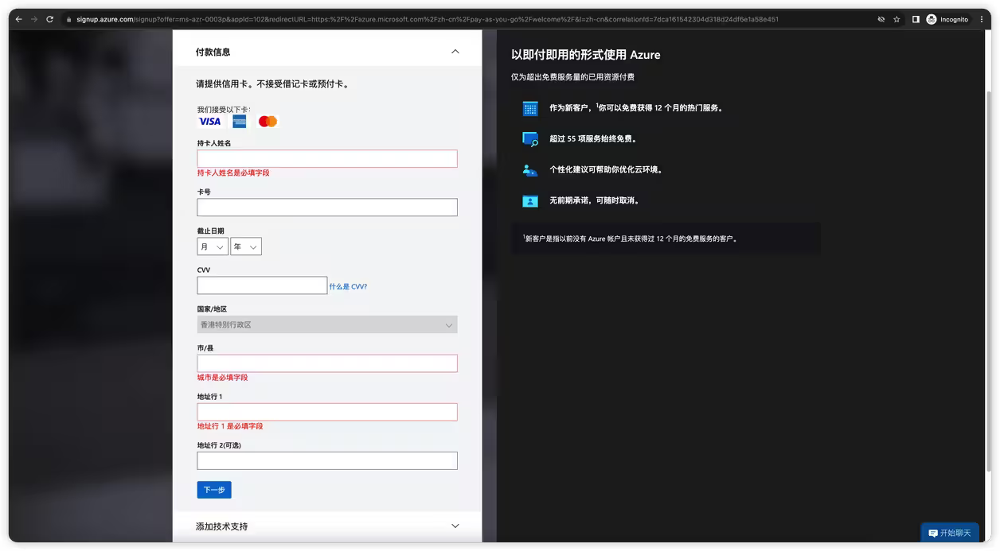
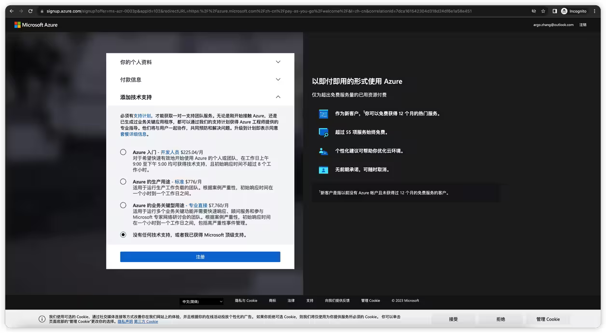
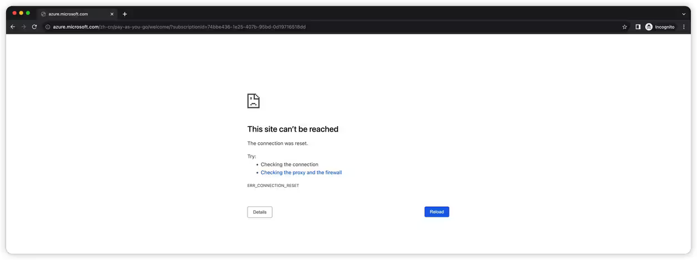
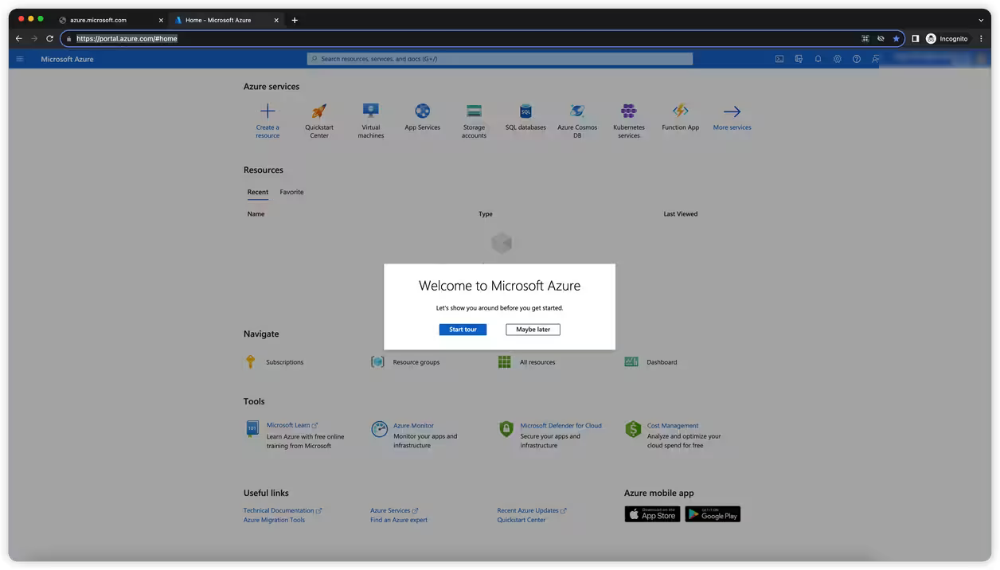

## 前言

微软最有价值专家是微软的一个年度奖项。MVP来自于各行各业，但是他们都有两个共同点：

- 精通某一个微软产品或技术领域。
- 愿意与他人分享技术经验。

成为微软最有价值专家最大的福利就是 Azure 的订阅赞助，如果是 Developer Technologies 方向的每个月有高达 $1000/month 的额度，即年额度 $12000/year，每年 7 月续任后发放，这个福利对于国内来说还是非常香的，那么新晋 MVP 该如何获得这个订阅赞助呢？

再开讲之前，我们丑话先说在前面，这个教程解决的问题是什么？我们面临的大坑有哪些？

- 首先 Azure 分国际版跟国内版，这个福利一定一定一定是国际版才可以
- 其次 Azure 账号归属国家不能是中国
- 再次如果先提交了微软 MVP 账号再申请 Azure 账号时由于 Azure 的限制会导致 MVP 登录邮箱与 Azure 福利登录邮箱地址不一致问题（2023年改版后，MVP 登录账户必须与Azure邮箱一致）

### 教程开始：

1. 登录国际版 Azure 

打开浏览器建议开启隐私模式，敲入地址：https://azure.microsoft.com/zh-cn/pricing/offers/ms-azr-0003p/?wt.mc_id=DT-MVP-5004174

点击即付即用按钮

如果以前申请过 Azure 的服务国家选的是中国，这里遇到第一个大坑，千万别用这个账号，如果使用这个账号，进入后就会造成无法领取 $12000 订阅赞助的问题。正确的方法是输入常用信箱（以前没有申请过 Azure 服务的）或者点击 Create one 重新申请一个信箱，专门用于微软 MVP 相关所有的事宜（后面还有 Office 权益 Teams 登录等事情）

输入邮箱地址与密码后，可能会要求录入辅助邮箱，要验证码，等一些列辅助功能，这些按照提示均可通过，最重要的事所有步骤走完后，可能会出现一个异常的界面

是不是你会想，微软也不过如此？这个问题我知道的反正已经 3 年了，放平心态，关闭网页，重新来过就会好，或者点击右上角 Sign in 你会发现你其实已经登录了。

2. 继续登录

上一步关闭浏览器或者在刚才的隐私模式浏览器地址栏中继续敲入：https://azure.microsoft.com/zh-cn/pricing/offers/ms-azr-0003p/?wt.mc_id=DT-MVP-5004174

这个地址，弹出邮箱登录输入刚才的地址与密码后正式进入到 Azure 门户

按照表单填写即可，注意看截图内红色文字，切记不要选中国，电话按照提示符合格式即可，最最最重要的是要勾选使用其他电话验证身份

很多人卡在这里

点击发短信给我，然后输入验证码，即可下一步啦

录入信用卡相关信息即可下一步，此处无坑，会扣 1$ 操作验证信用卡是否可用

录入信用卡信息后，最后一步点击注册

点击注册后又是一个熟悉的界面

不要慌，我们从头再来，

3. 门户登录

地址栏录入：https://portal.azure.com/?wt.mc_id=DT-MVP-5004174#home

此时网页会自动跳转进去，界面如图：

终于成功了。可以在订阅下查看信用卡绑定情况，如果未看到信用卡，就是绑定失败，可能是禁止国外无卡交易了。

遇到问题可以随时加我微信或者QQ，提供帮助 5196060
