本文记录 on board 过程中遇到的小问题和没用小技巧。

## MVP Portal

当你收到来自微软的确认邮件之后，你将正式被接纳为微软现任 MVP 的一员。从此刻开始，你便拥有了 MVP portal 上相关的操作权限。

MVP portal 的地址是 <https://mvp.microsoft.com/en-US/account/>。这实际上就是你进行材料申请提交时的网址。

当你得到通过之后，便可以在一级菜单中看到额外的一些操作菜单。

探索这个区域，是你接下来非常值得做的一件事情。

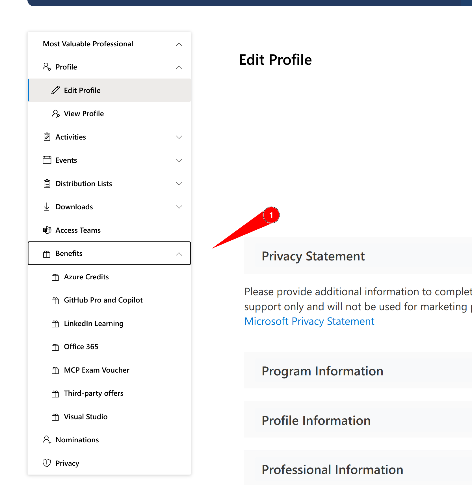

## 常见问题

阅读一个网站的“常见问题”清单，往往能解决一个急于上手的新人很多问题。

MVP portal 也同样提供了这样一个简要的清单，从各个方面解答了一些常见的使用问题。

你可以通过以下链接进行阅读：

<https://mvp.microsoft.com/en-US/faq?section=mvp#mvp-current-members-0>

## 签署保密协议（NDA） TODO: 这个部分由于网站更新，我们正在等待新的截图和内容，敬请期待！

当你成为微软 MVP 之后，你将有权参加一些微软组织的非公开会议和获取非公开内容。因此，微软要求 MVP 签署一份保密协议以获取这些内容。

你可以在以下链接查阅、下载并签署保密协议：

<https://mvp.microsoft.com/zh-cn/Awards/my-mvp-award-non-disclosure-agreement-nda>

整个过程全部在线上进行，非常简单，但是非常重要。

签署保密之后，你便可以通过以下链接来订阅你感兴趣的邮件组，以便得到最新的非公开内容通知。

<https://mvp.microsoft.com/zh-cn/Opportunities/my-opportunities-mvp-nda-distribution-list>

如果你发现签署 NDA 的时候在线签署向导一直卡在生成 PDF 的提示页面的情况，请使用 Chromium 内核的 Microsoft Edge 的 Internet Explorer 模式，或者直接掏出虚拟机进入旧版 Windows 打开 Internet Explorer 去进行 NDA 的在线签署即可。（毕竟通过使用 F12 开发者工具粗略看了下，看起来签署向导的 PDF 生成模块和 Chromium 内核的 Microsoft Edge 不大兼容）

## 始终遵守社区行为准则

社区行为准则内容见下图。

如您遇到违反社区行为准则的情况，请及时告知我们。我们商议后，一起做出恰当处理。

您也可以参看[Code of conduct](https://mvp.microsoft.com/en-US/faq?section=mvp#mvp-code-of-conduct-0)。

## MVP 个人简介

作为 MVP ，我们非常建议您可以在 MVP portal 上完善您的个人简介。并上传一张您的头像。这将对您的影响力产生非常大的帮助。

您可以通过 MVP portal 的以下菜单来进行个人简介的编辑：

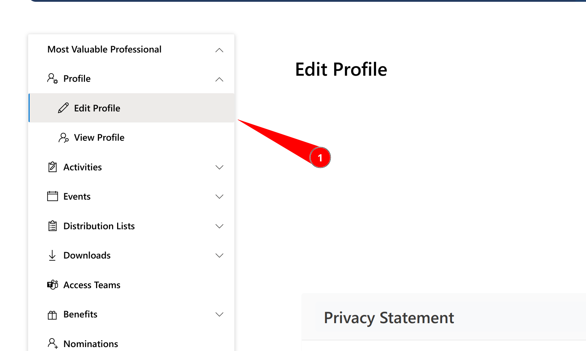

## MVP Credly 徽章和证书

在成为 MVP 后，你会收到一封 MVP Credly 徽章和证书的领取邮件，这是一种新的提供方式，你可以向全世界分享你的徽章。

如果你收到了直接添加徽章的邮件，点击接受链接即可获取。如果你没有收到相关邮件或收到了可以领取徽章的提醒邮件，那么你可按照下面的方式操作：

1. 若你尚未拥有 Credly 账户，可以前往注册 [Credly](https://info.credly.com)。
2. 填写该表单 [https://aka.ms/MVPCredlyForm](https://aka.ms/MVPCredlyForm)，提供 MVPID 、姓名和 Credly 账户的关联邮箱。
3. 等待审核通过的邮件，在邮件中找到接受链接，领取徽章。

邮箱建议最好和 MVP 使用同一个，可以避免麻烦。Credly 登录注册时，你可以使用第三方授权，其会从第三方获取你的邮箱信息。如果你有多个 Credly 账户，也不用担心，在 Credly 的账户管理中心，你可以添加多个邮箱地址，也可以进行账户合并。

当完成徽章添加后，在徽章的详情页面的右上方有一个 “Share” 分享按钮，点击后你可以看到如下的分享界面，选择 “Download Certificate” 即可下载你的 MVP 证书。

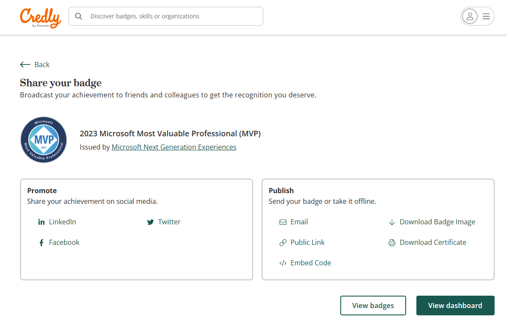

## 各种权益

微软和很多第三方厂商为微软 MVP 提供了很多权益以便 MVP 可以在后续的社区工作中进一步发挥影响力。其中包括一些广为人知的：

- Azure 免费额度
- Visual Studio Enterprise 订阅
- Office 365
- Github Pro
- Jetbrain 全家桶授权
- Visual Assist X 免费 NFR 授权
- Telerik 免费 NFR 授权
- DevExpress 免费 NFR 授权
- RedGate 免费 NFR 授权
- Pluralsight 所有课程免费阅读
- TechSmith 免费 NFR 授权

其中绝大部分的申请和使用都非常的简单，通过 MVP Portal 中的帮助内容，你便可以了解如何进行这些权益的申请。

目前，第三方福利已经转移到**MVP Award Program的Teams群组，下面的Opportunities里了**。大家在个人页面点击第三方福利，会跳转到这里。如果您还没有加入该Teams群组，可联系我们申请加入。

此群组为全球项目官方沟通渠道，项目组通知、活动信息、PGI信息和录像都在其中，大家加入后可以多多查询其中资源。

以下提一些我遇到的比较特殊的权益申请问题和办法。

### Github Copilot

你可以[通过Azure订阅Github Copilot.pdf](通过Azure订阅Github Copilot.pdf)

### Extended Azure Credit Benefit

微软在 Visual Studio Enterprise 订阅提供的 150 美元额度的基础上，为特定领域的 MVP 提供了更多的额度，以便 MVP 可以开展更多的活动。

特定的领域包括有：人工智能、云和数据中心管理、数据平台、开发者技术或企业移动性。

你可以通过以下地址来申请额度:

<https://mvp.microsoft.com/zh-cn/Benefits/extended-azure-credit-benefit>

这里说明一下申请过程存在特殊情况。

#### 账号邮箱

对于中国的 MVP 需要提供结尾不是.cn 的微软账号邮箱。并且，这个账号必须在 Azure Portal 中的 Billing Region 必须以下链接中给定的组合。

<https://azure.microsoft.com/zh-cn/offers/ms-azr-0036p/?WT.mc_id=DT-MVP-5004283>

因此，如果你的账号已经注册的 Azure，并且区域已经选择了 CN。那么，这个账号将不能够适用于这项申请。

你可以通过“Cost Manager+Billing”来查看当前账号的 Billing 所属的区域：

<https://docs.microsoft.com/en-us/azure/cost-management-billing/manage/change-azure-account-profile?WT.mc_id=DT-MVP-5004283>

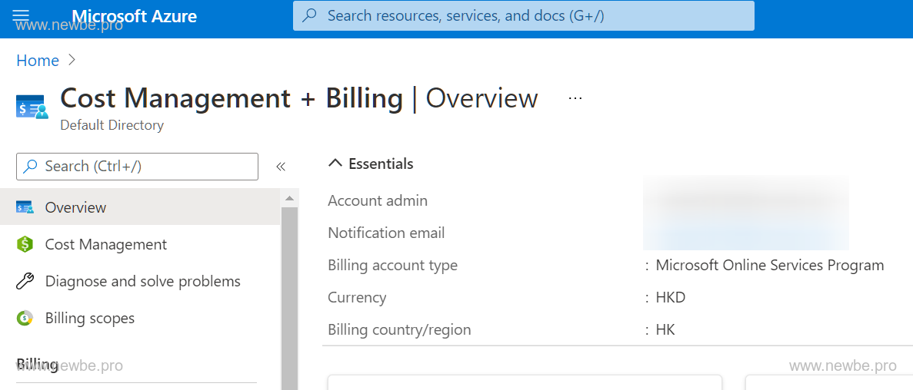

注意，Billing Region 截至目前是无法进行修改的，故而，你需要重新注册一个微软账号来进行权益申请。

#### 注册新账号

如果经过查看，你的账号已经满足所属的区域，则可以跳过此步骤。

首先，你可以通过 www.hotmail.com 注册一个全新的微软账号。

然后在你可以通过以下链接来注册一个新的 Azure 账号。

<https://azure.microsoft.com/free/?WT.mc_id=DT-MVP-5004283>

注册时，可以选择区域为 HK。并绑定一张支持 Visa 或者万事达的信用卡。

小知识，你可以绑定以前别的的账号绑定过的信用卡，而且即使这样，新注册的账号也还是会收到新账号的 12 个月大礼包。

这样，你就准备好了一个符合要求的可申请账号。

注册完毕之后，你还需要到 MVP Portal 中，通过以下链接修改你的主要邮箱地址为新账号地址：

<https://mvp.microsoft.com/zh-cn/MyProfile/EditPersonalInfo>

修改主要邮箱这一步并不是必要的，但是这样可以避免一小部分问题，下一步将会体现。

修改完主要邮箱之后，你便可以通过 MVP Portal 上的链接来提交申请。

#### 接收额度

申请审核通过之后，微软便会发送通知邮件到你的主要邮箱当中。

现在要做的就是接受额度。

首先，你需要使用隐身模式打开一个全新的浏览器窗口。**这很重要！这样可以避免你绑定了错误的账号。**

然后使用符合申领条件账号登录 Azure。

接着登录你的主要邮箱，查看审核结果的邮件，点击邮件上的按钮便可以开始尝试绑定额度了。

> 绑定过程

首先进入MVP网站 -> [Azure 额度延伸权益](https://mvp.microsoft.com/zh-cn/Benefits/extended-azure-credit-benefit)

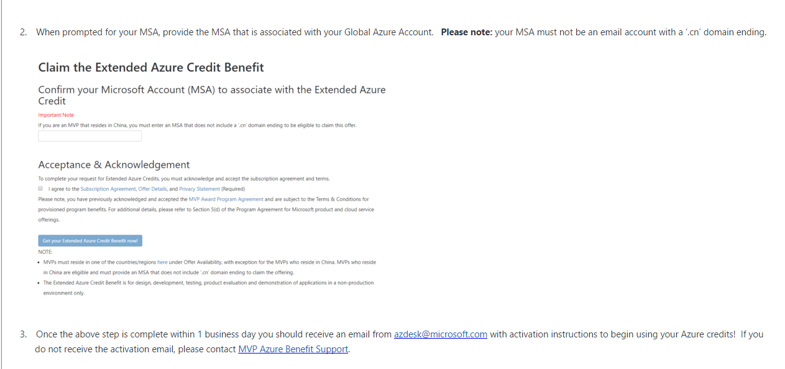

在 Claim the Extended Azure Credit Benefit 的输入框中输入非CN的邮箱账号，然后勾选Acceptance & Acknowledgement,在点击Get按钮，如图

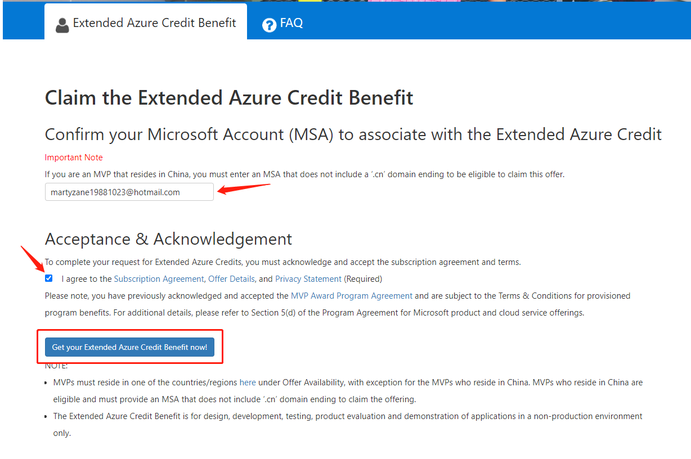

结果如下所示

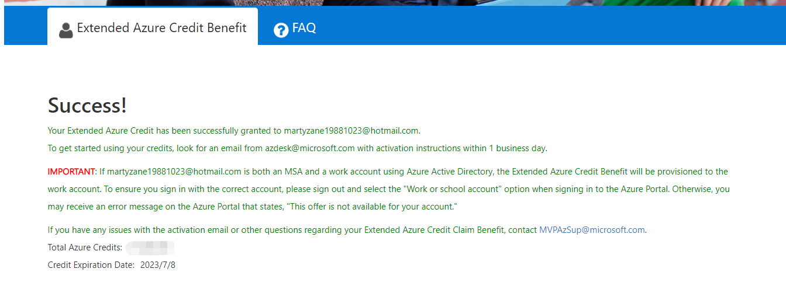

绑定过程比较简单,接下来需要等待1个工作日，如果遇到周五则需要等待3天，很幸运，我就是需要等3天。

绑定完成之后，便可以在以下地址中查看额度的余额和使用情况了：

<https://www.microsoftazuresponsorships.com/>

#### 错误地把“Extended Azure Credit Benefit”权益绑定到了CN账号的补救措施

因为“Extended Azure Credit Benefit”权益只能绑定到非CN账号，但是在MVP Support发放权益的时候不会检查这一点，这就造成激活权益的时候Azure会弹出提示“账户所在的国家/地区不提供此产品/服务”。这种情况下，可以在CN账号上提交“支持请求(Ticket)”，请求工作人员把CN账户上的权益转移到非CN账户上。

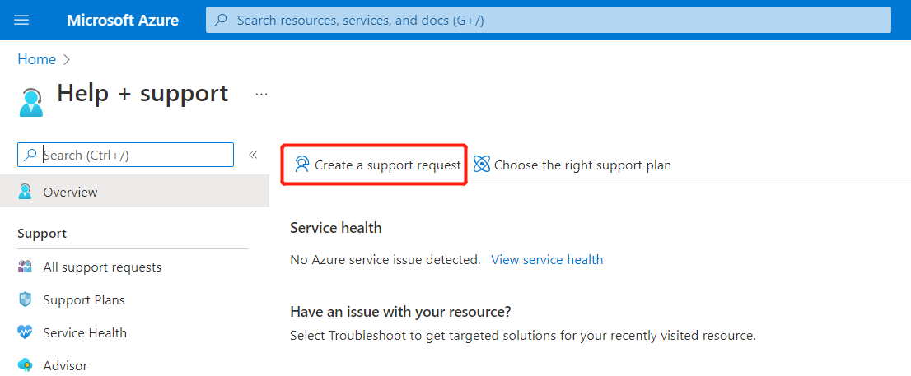

#### 为其他的账号授权

如果你使用的是新账号申领的额度。那么你可能会面临现在有两个账号，有时需要进行切换的窘境。

那么，你可以选择将你 CN 的账号加入到 HK 账号的 AD 之下，并且赋予对应 Subscription 完全控制的权限。

通过这样操作，你便可以在 CN 账号下完成资源的管理。操作非常简单：

首先，将 CN 的账号加入到 HK 的账号 AD 中：

<https://docs.microsoft.com/zh-cn/azure/active-directory/fundamentals/add-users-azure-active-directory?WT.mc_id=DT-MVP-5004283>

然后，赋予 CN 账号一定的角色：

<https://docs.microsoft.com/zh-cn/azure/active-directory/fundamentals/active-directory-users-assign-role-azure-portal?WT.mc_id=DT-MVP-5004283>

最后，配置 Subscription IAM：

<https://docs.microsoft.com/azure/cost-management-billing/manage/add-change-subscription-administrator?WT.mc_id=DT-MVP-5004283>

经过一小段时间的等待，你便可以在 CN 的账号之下管理这个 Super rich subscription 了。

### Jetbrain 付费插件

Jetbrain 全家桶权益，不仅仅包含了 Jetbrain 所有的 IDE。实际上还包含了部分插件商城中的付费插件。

即，MVP 同样也可以申请免费的部分付费插件许可。

以下以 Material Theme UI 这个插件为例。打开其在商城中的网站。

<https://plugins.jetbrains.com/plugin/8006-material-theme-ui/pricing>

并使用你申请全家桶时使用的账号进行登录，便可以在下图所示的位置，查看到可以免费兑换授权的 Discount:

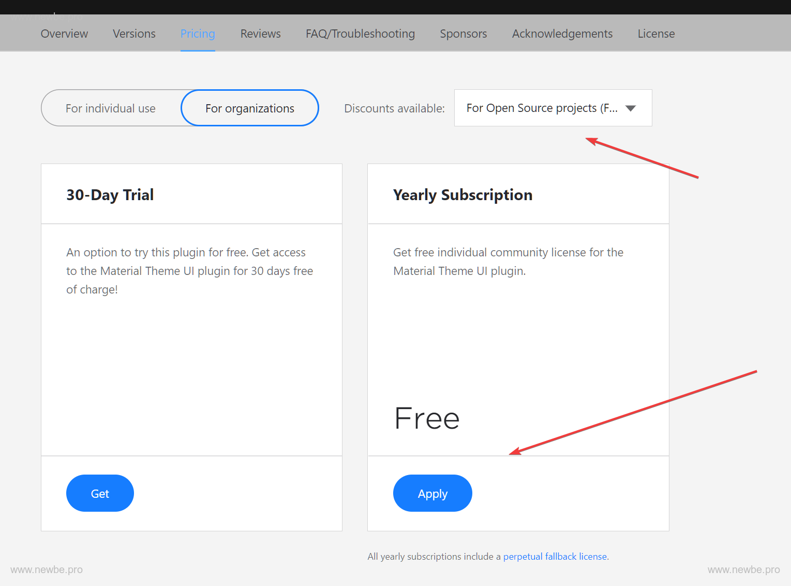

点击 Apply 之后，稍后便会收到对应的邮件，按照邮件提示操作便可以轻松取得对应的授权。

然后，你需要进入 IDE 的 “Manage License” 选项卡，便可以将授权与插件匹配生效。

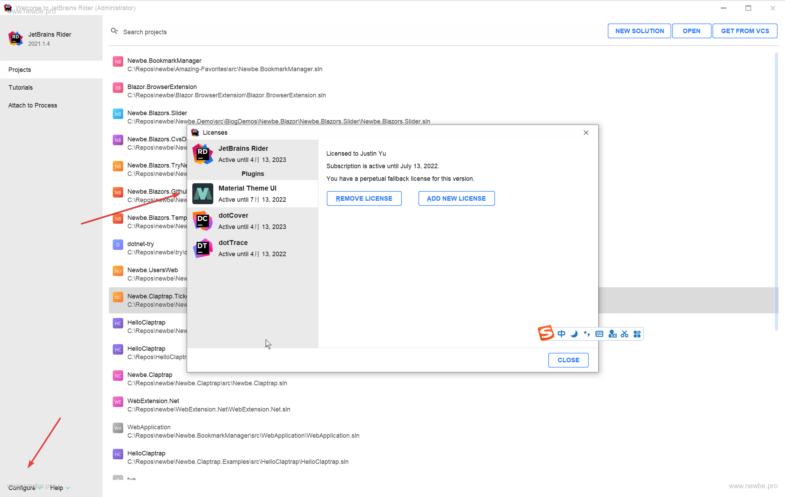

> 对于常规的开源项目授权也可以使用此方法操作，效果相同。其实，因为 MVP 对应的授权已经被我使用过了，上图就会开源项目授权的示例图。

## Github MVP Group

你可以选择加入 Github MVP Group 来使得你的组织徽标喜加一。

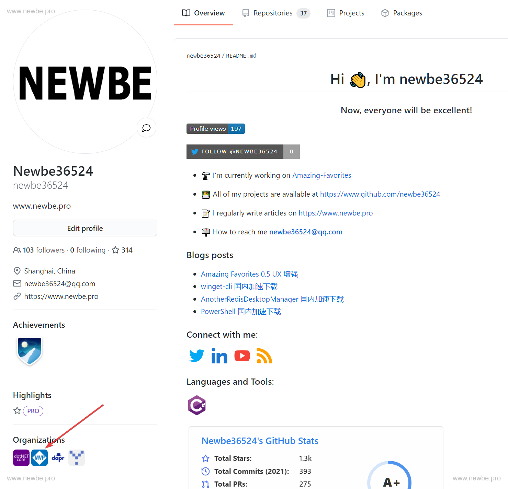

你可以参阅以下地址的内容来获取如何加入该群组的方法：

<https://github.com/msmvps/join-this-organization>

## MVP大礼包

大礼包包含微软给MVP提供的证书、奖杯等内容

> 大礼包开箱视频：https://www.bilibili.com/video/BV1sL411J7U5

微软会通过联邦快递将礼包寄到你的手上，这里需要海关清关，联邦快递会电话询问里采用什么方式清关，通常分为企业和个人。

### 企业快件快速清关

1. 适合有正式工作单位的MVP
2. 不用理会没有包含公司物品清关选项的短信和邮件
3. 等快递电话，或直接拨打 400-886-1888，提供快递单号，要求清关部分电话联系
4. 告知物品是微软寄送的会议相关样品，希望走公司样品快速清关流程
5. 提供公司名称（小姐姐会在系统里查询核对），如果公司有过Fedex的往来，直接完成，如果没有，按提示提供公司的信息（我基本没遇到）
6. 如果问到物品清单，告知“我也不知道啊，你就按盒子上的清单写吧”
7. 结束通话等待派送

### 个人物品清关流程

1. 如果你选择个人物品清关，你会收到一封邮件，内容如下

2. 打开邮件中的PDF文件，里面包含了快递面单、发票的扫描件，发票中包含了礼包内物品清单。

3. 打开邮件中的超链接

  - 根据发票内容填写清关物品清单，注意需要翻译成中文。

  - 上传身份证正反面

  - 关于“网购订单截图”、“付款证明”，我是上传了PDF中的发票和MVP站点发货信息，也有朋友手写证明，目前看来均可。

4. 等待运输和清关，期间联邦快递的工作人员可能还会关于清关问题向你询问一些事情，如实回答即可。

5. 喜提大礼包

### 个人物品清关注意事项

如果你没有收到相关邮件而是收到了清关提醒的短信，你需要通过短信中描述的电话号码去联系他们获取快递面单发票的扫描件的 PDF 文件。

当你通过邮件获取 PDF 以后，你就可以开始根据短信上的提示开始在线清关申报了，其中你需要按照 PDF 的内容在 MVP Kit 内包含的物品清单，由于需要进行中文翻译，为了让后面阅读到文章的朋友在遇到类似的情况时可以轻松一点，我把我填写的相关内容整理成表以供参考。

P.S. 由于要写的内容还是比较多，为了能够让表格变得不那么长，于是一些重复内容我会在表前注明。

- 每种物品的数量皆为 `1`
- 每种物品的单位皆为 `件`
- 每种物品的货币类型皆为 `美元`
- 每种物品的品牌型号或用途来源皆为 `MVP Award Kit`
- 每种物品的物品主类皆为 `其他物品`
- 每种物品的物品子类皆为 `其他物品`

| 物品名称 (英文)           | 物品名称 (译文) | 材料   | 单价值 |
|---------------------------|-----------------|--------|--------|
| Crystal Award Gift        | 水晶奖礼品      | 塑料等 | 56.3   |
| MVP Award Box             | MVP奖励盒       | 塑料等 | 1      |
| Certificate               | 证书            | 纸等   | 1      |
| Certificate Holder        | 证书盒          | 塑料等 | 1      |
| Certificate Plastic Cover | 证书塑料套      | 塑料等 | 1      |
| Lapel Pin                 | 襟针            | 金属等 | 1      |
| ID Card                   | 证件卡          | 塑料等 | 1      |
| Dark Navy Gift Box        | 礼品盒          | 塑料等 | 1      |
| 3-Panel Insert            | 三折页插页      | 纸等   | 1      |
| Foam Insert               | 泡沫包装        | 泡沫等 | 1      |
| MVP Sticker Sheet         | MVP贴纸         | 纸等   | 1      |
| NDA Packet Envelope       | NDA资料袋信封   | 纸等   | 1      |
| Notice to Receiver        | 收件人通知      | 纸等   | 1      |
| Code of Conduct Letter    | 行为准则信      | 纸等   | 1      |

> 注：自2023年开始，大礼包仅包含水晶奖杯和MVP奖励盒（如上表格前两项所示），证书和徽章等其他物品将不再纳入其中，改为提供电子版。

## MVPGA可以帮助您解决哪些问题

如遇和项目组、活动、福利有关的问题，可以写邮件至MVPGA@microsoft.com，工作日办公。

最好用英文书写邮件给mvpga，并抄送chinamvp@microsoft.com或twmvp@microsoft.com或hkmvp@microsoft.com。

邮件内容包括：

1.您的姓名和MVPID号

2.清楚描述您需要的支持

3.必要时请截图

## MVP与产品组和项目组的沟通渠道

### 1.Distribution list（DL）:在MVP签署NDA保密协议后，可申请加入不同技术方向的DL。

该技术方向的产品组经理会通过DL邮件与MVP进行直接沟通，这种保密性质的沟通方式，可以让更高效地反馈和回复问题。
点击链接[MVP DLs](https://mvp.microsoft.com/en-us/Opportunities/my-opportunities-mvp-nda-distribution-list)申请加入DL。
DL邮件的名称一般是[技术方向名称]-MVP-NDA@mstechdiscussions.com，请设置为信任邮箱，以确保正常接收。
我们一般会根据您的技术领域自动加您进入该DL，您可以设置收件系统，将这些DL邮件归档，不影响您正常办公。

您通过MVP-NDA DL反馈的内容可以包括：

•	相关技术问题或产品反馈

•	和产品组人员确认技术性能

•	顾客场景

•	产品路线图和最新功能 

•	如何撰写文档

•	技术相关的演讲和大型活动参加机会 

MVP-NDA DL邮件请不要反馈以下内容：

•	产品组团队不能回复的题外话 

•	MVP项目相关的一般问题

•	MVP项目福利

•	个人问题反馈和投诉

•	商业发展或工作机会 

您可以登录MVP NDA DL member site page(link) ，了解更多关于DL的内容。

### 2.Product Group Interaction (PGI)产品组互动活动：线上与产品组面对面交流的良好机会。

•	Private Events私人活动: 通过邮件邀请，仅对所在技术领域的MVP开放，需要遵守NDA 保密协议。

•	Public Events公共活动: 对所有MVP开放，需要遵守NDA 保密协议。

•	PGI信息由MVP Engagement 账号发出，CPM社区项目经理会及时转发给大家。

•	每次参加PGI时，会记录您的英文名字，**请展示和您的个人资料相同的姓名**。

往期PGI会议录像，可到MVP Award Program的Teams群下面的Product Group Interaction里找到。

### 3.Global MVP Award Program Teams群组

请您到Teams中申请加入MVP Award Program群组，大家可在该群里互动、提问、发布活动信息等等。
这个群也是每年MVP全球峰会的线上收看平台。

如您有任何问题，可到“? Get Help” 下提问。

在“ Opportunities机会”这个栏目下，您可以看到一些全球和地方活动信息。

上面提到在“Product Group Interaction产品组互动”栏目下，您可以按技术类别找到往期PGI视频。

## MVP项目博客和社交账户：

MVP项目官方网站：<www.mvp.microsoft.com>

MVP技术博客网页：Microsoft MVP Award Program Blog - [Microsoft Tech Community]([http://blogs.msdn.com/b/mvpawardprogram/](https://techcommunity.microsoft.com/t5/microsoft-mvp-award-program-blog/bg-p/MVPAwardProgramBlog))

[MVP项目Twitter](https://twitter.com/#!/mvpaward)

[MVP Award Program Channel 9](https://channel9.msdn.com/tags/MVP/)

以下项目投稿渠道，欢迎您英文投稿：

o	Technical Tuesday – 相关技术内容

o	Friday Five – 相关技术内容

o	MVP Award Program Blog – 体现MVP社区领导力和贡献的社区故事

## MVP & RD 知识库

全球MVP和RD贡献的有关技术和软技能方面的文章、视频和演讲等内容分享。

您可以MVP & RD 通过加入MVP Award Teams获取该知识库内容。

知识库内容会不断更新，如您想贡献内容，联系我们。

## 领英上如何正确填写MVP奖励
第1步 – 请注意MVP奖励不是您的工作经历，它是微软颁发给社区贡献者的一个奖项，请在您的个人页面，“Add profile section”类型选项中，选择“Accomplishments个人成就” 选项下面的“Honors & Awards荣誉奖项” 这一选项。

第2步- 进入“添加奖项”，填写奖项名称、颁发机构、颁发时间。“相关经历“”建议您空着不要填写，因为这会让人误解和工作相关。

## 微软DevRel团队给予MVP项目的支持

**请注意：DevRel团队的其他成员并不是MVP项目的共同负责人，他们会在一些社区活动中给予我们支持。在您与他们合作举办活动之前，请也告知我们。**

1.Reactor Center:位于上海的实体活动地点，可提供线下场地支持和线上活动B站和CSDN直播、活动宣传文案等支持。

2.微软MSDN公众号、微博：可提供MVP活动宣传转发、MVP精选文章转发。

3.比特熊直播间：MVP 英雄故事+技术直播+录像花絮

4.MVP技术茗品会

5.技术加油站：提供活动纪念品支持

## 全球MVP月报Bits & Bytes征稿

欢迎您撰写发生在技术社区中的故事，我们会根据每月主题，将您的故事投稿到全球月报。

## GCR MVP/RD 活动快报

请在每次组织和参加活动前后告知我们，每两月我们会制作GCR活动快报。

## 如何使用 参与者 ID

### 找到 ID

您可以在 MVP portal 上找到对应的 ID。

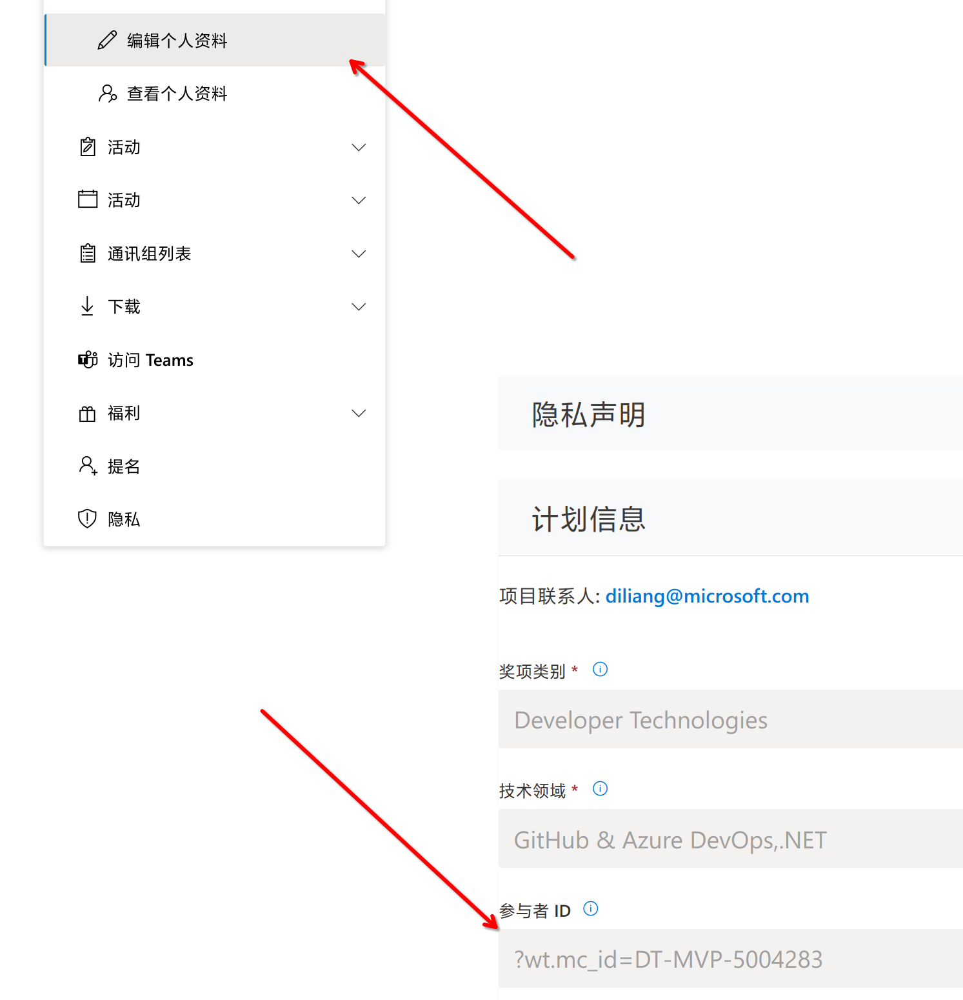

### 工作原理

在您想要引用或链接的Microsoft Docs或Learn的原始网页网址后面添加上您的专属ID（CreatorID）。

比如，原始网址是：https://docs.microsoft.com/en-us/powerapps/
您的专属ID是：?WT.mc_id=DT-MVP-5004283
最后生成的网址是：https://docs.microsoft.com/en-us/powerapps/?WT.mc_id=DT-MVP-5004283

### 插件更好

当然，为了更加简便的使用，您可以安装插件：

<https://chrome.google.com/webstore/detail/skilling-champion-extensi/eichjbmnicihhbhodbejfkceoknaclfd>

然后在插件选项中，添加您的 id：

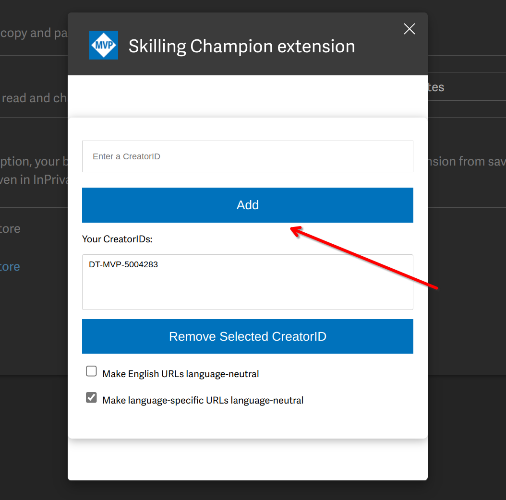

然后就可以在右键链接的时候，直接拼接 id 了：

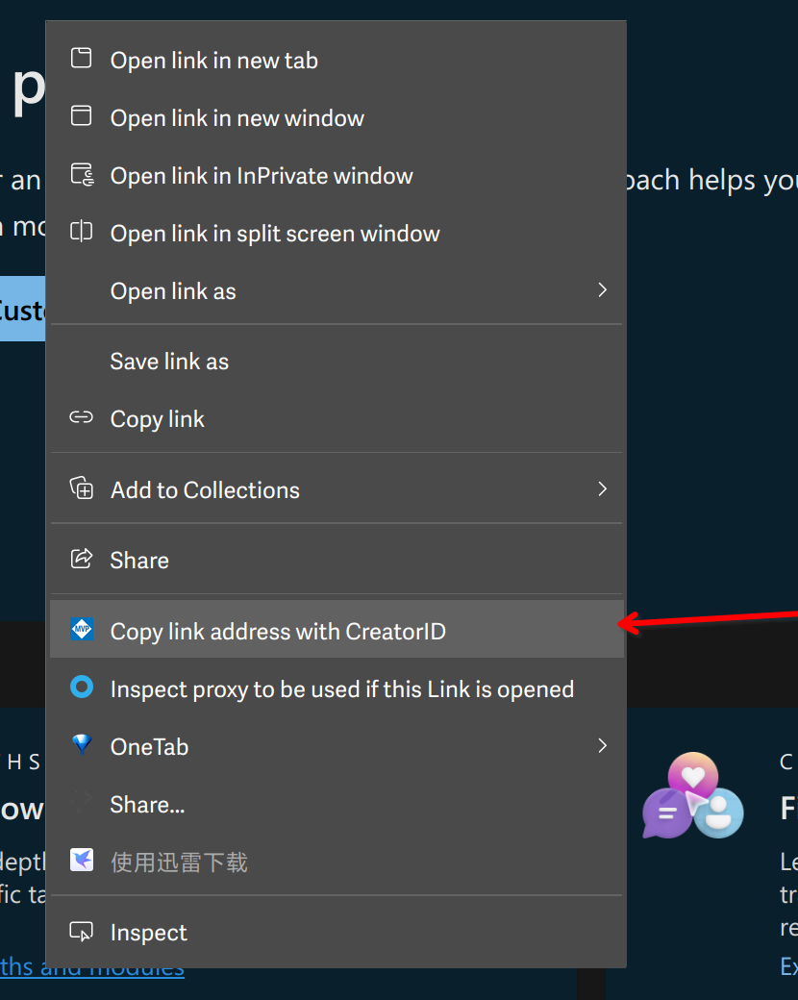
