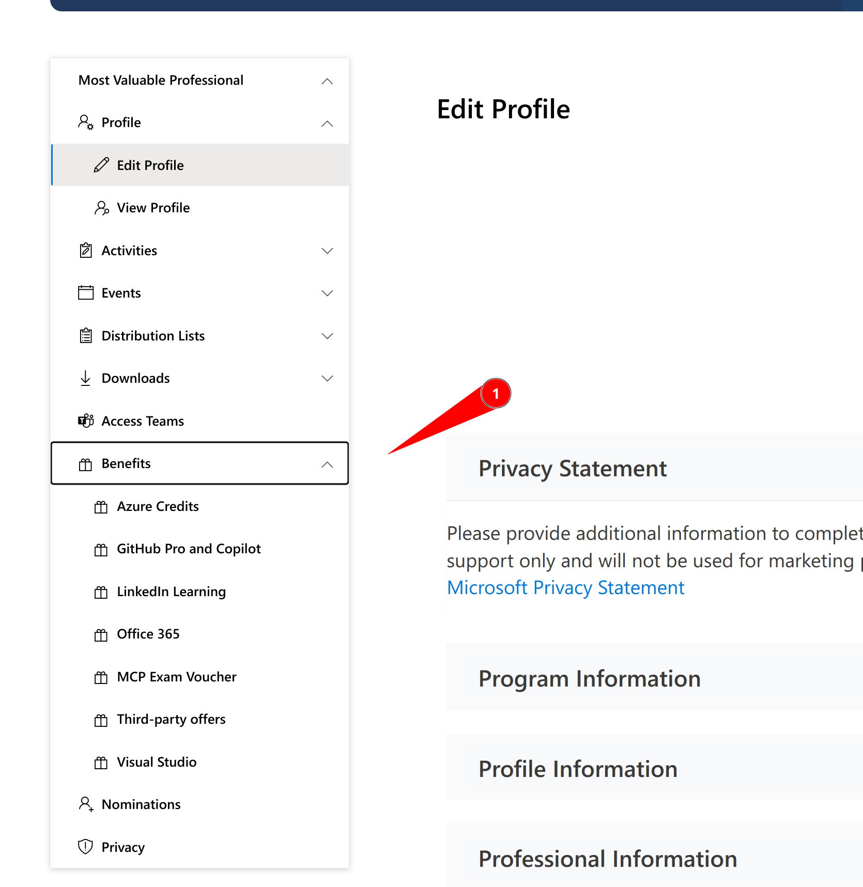
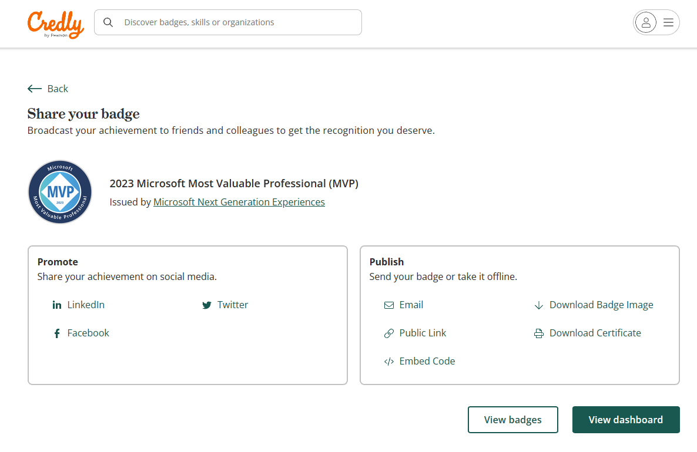
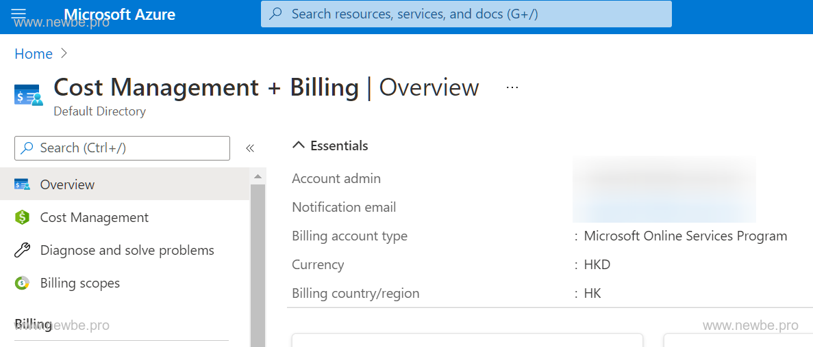
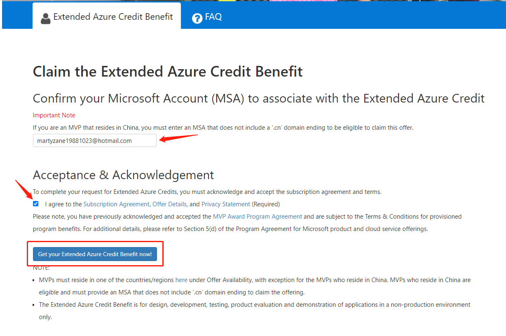
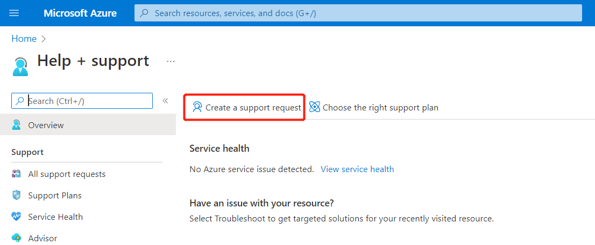
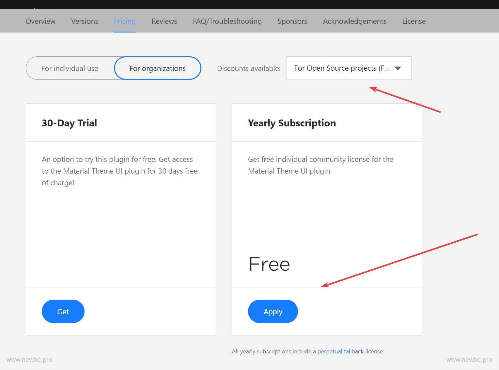
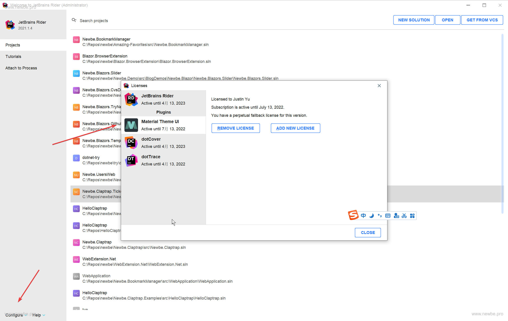
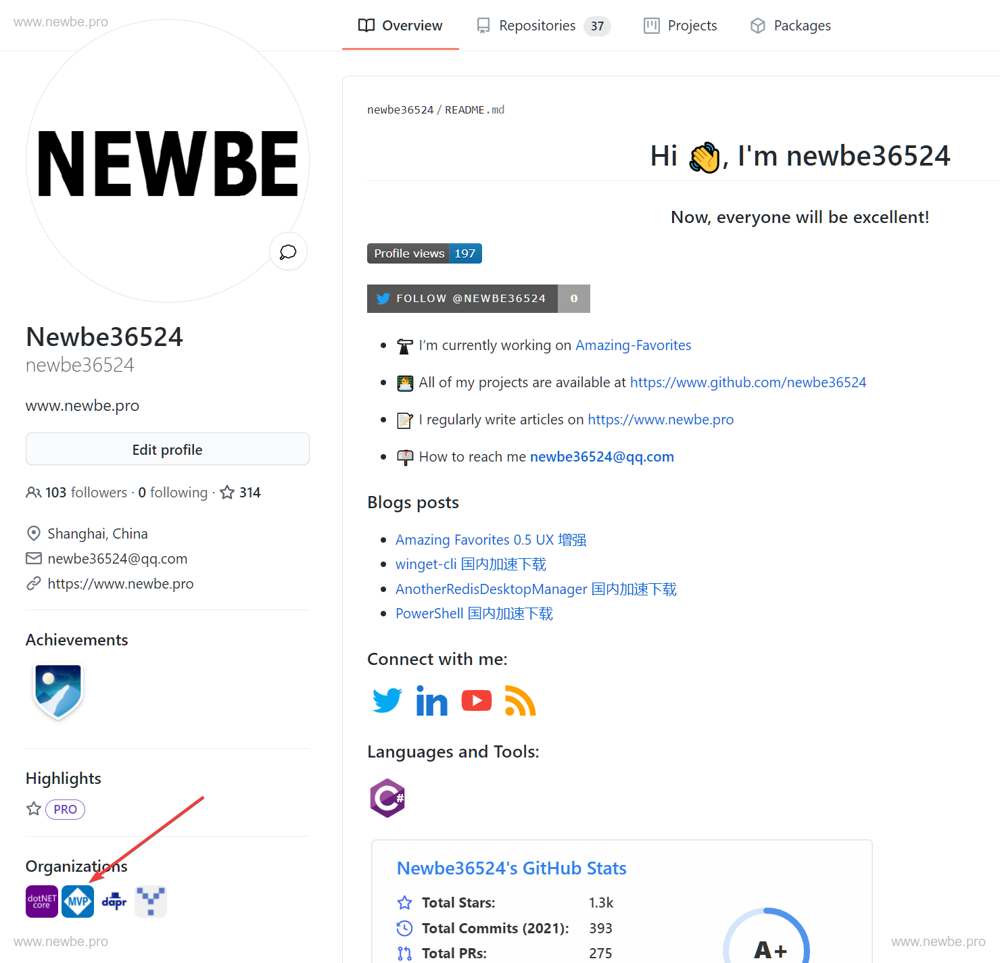
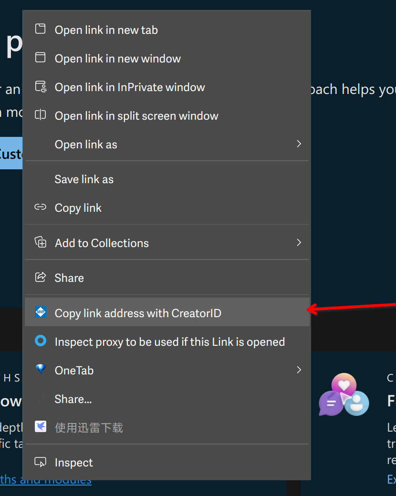

本文記錄 on board 過程中遇到的小問題和沒用小技巧。

## MVP Portal

當你收到來自微軟的確認郵件之後，你將正式被接納為微軟現任 MVP 的一員。從此刻開始，你便擁有了 MVP portal 上相關的操作許可權。

MVP portal 的地址是 <https://mvp.microsoft.com/en-US/account/>。這實際上就是你進行材料申請提交時的網址。

當你得到通過之後，便可以在一級功能表中看到額外的一些操作功能表。

探索這個區域，是你接下來非常值得做的一件事情。

## 常見問題

閱讀一個網站的「常見問題」清單，往往能解決一個急於上手的新人很多問題。

MVP portal 也同樣提供了這樣一個簡要的清單，從各個方面解答了一些常見的使用問題。

你可以通過以下連結進行閱讀：

<https://mvp.microsoft.com/en-US/faq?section=mvp#mvp-current-members-0>

## 签署保密协议（NDA） TODO: 这个部分由于网站更新，我们正在等待新的截图和内容，敬请期待！

當你成為微軟 MVP 之後，你將有權參加一些微軟組織的非公開會議和獲取非公開內容。因此，微軟要求 MVP 簽署一份保密協定以獲取這些內容。

你可以在以下連結查閱、下載並簽署保密協定：

[HTTPs://mvp.microsoft.com/zh-cn/Awards/my-mvp-award-non-disclosure-agreement-nda](https://mvp.microsoft.com/zh-cn/Awards/my-mvp-award-non-disclosure-agreement-nda)

整個過程全部線上上進行，非常簡單，但是非常重要。

簽署保密之後，你便可以通過以下連結來訂閱你感興趣的郵件組，以便得到最新的非公開內容通知。

[HTTPs://mvp.microsoft.com/zh-cn/Opportunities/my-opportunities-mvp-nda-distribution-list](https://mvp.microsoft.com/zh-cn/Opportunities/my-opportunities-mvp-nda-distribution-list)

如果你發現簽署 NDA 的時候線上簽署嚮導一直卡在生成 PDF 的提示頁面的情況，請使用 Chromium 內核的 Microsoft Edge 的 Internet Explorer 模式，或者直接掏出虛擬機器進入舊版 Windows 打開 Internet Explorer 去進行 NDA 的線上簽署即可。（畢竟通過使用 F12 開發者工具粗略看了下，看起來簽署嚮導的 PDF 生成模組和 Chromium 內核的 Microsoft Edge 不大相容）

## 始終遵守社區行為準則

社區行為準則內容見下圖。

如您遇到違反社區行為準則的情況，請及時告知我們。我們商議後，一起做出恰當處理。

您也可以参看[Code of conduct](https://mvp.microsoft.com/en-US/faq?section=mvp#mvp-code-of-conduct-0)。

## MVP 個人簡介

作为 MVP ，我们非常建议您可以在 MVP portal 上完善您的个人简介。并上传一张您的头像。这将对您的影响力产生非常大的帮助。

您可以通过 MVP portal 的以下菜单来进行个人简介的编辑：

## MVP Credly 徽章和證書

在成為 MVP 後，你會收到一封 MVP Credly 徽章和證書的領取郵件，這是一種新的提供方式，你可以向全世界分享你的徽章。

如果你收到了直接添加徽章的郵件，點擊接受連結即可獲取。如果你沒有收到相關郵件或收到了可以領取徽章的提醒郵件，那麼你可按照下面的方式操作：

1. 若你尚未擁有 Credly 帳戶，可以前往註冊 [Credly](https://info.credly.com)。
2. 填寫該表單 [HTTPs://aka.ms/MVPCredlyForm](https://aka.ms/MVPCredlyForm)，提供 MVPID 、姓名和 Credly 帳戶的關聯郵箱。
3. 等待審核通過的郵件，在郵件中找到接受連結，領取徽章。

郵箱建議最好和 MVP 使用同一個，可以避免麻煩。Credly 登錄註冊時，你可以使用協力廠商授權，其會從協力廠商獲取你的郵箱資訊。如果你有多個 Credly 帳戶，也不用擔心，在 Credly 的帳戶管理中心，你可以添加多個郵箱位址，也可以進行帳戶合併。

當完成徽章添加後，在徽章的詳情頁面的右上方有一個 「Share」 分享按鈕，點擊後你可以看到如下的分享介面，選擇 「Download Certificate」 即可下載你的 MVP 證書。

## 各種權益

微軟和很多協力廠商廠商為微軟 MVP 提供了很多權益以便 MVP 可以在後續的社區工作中進一步發揮影響力。其中包括一些廣為人知的：

- Azure 免費額度
- Visual Studio Enterprise 訂閱
- Office 365
- Github Pro
- Jetbrain 全家桶授權
- Visual Assist X 免費 NFR 授權
- Telerik 免費 NFR 授權
- DevExpress 免費 NFR 授權
- RedGate 免費 NFR 授權
- Pluralsight 所有課程免費閱讀
- TechSmith 免費 NFR 授權

其中絕大部分的申請和使用都非常的簡單，通過 MVP Portal 中的説明內容，你便可以瞭解如何進行這些權益的申請。

目前，協力廠商福利已經轉移到**MVP Award Program的Teams群組，下面的Opportunities裡了**。大家在個人頁面點擊協力廠商福利，會跳轉到這裡。如果您還沒有加入該Teams群組，可聯繫我們申請加入。

 

此群組為全球專案官方溝通管道，專案組通知、活動資訊、PGI資訊和錄影都在其中，大家加入後可以多多查詢其中資源。

以下提一些我遇到的比較特殊的權益申請問題和辦法。

### Github Copilot

你可以[通过Azure订阅Github Copilot.pdf](./通过Azure订阅Github%20Copilot.pdf)

### Extended Azure Credit Benefit

微軟在 Visual Studio Enterprise 訂閱提供的 150 美元額度的基礎上，為特定領域的 MVP 提供了更多的額度，以便 MVP 可以開展更多的活動。

特定的領域包括有：人工智慧、雲和資料中心管理、資料平臺、開發者技術或企業移動性。

你可以通過以下位址來申請額度:

[HTTPs://mvp.microsoft.com/zh-cn/Benefits/extended-azure-credit-benefit](https://mvp.microsoft.com/zh-cn/Benefits/extended-azure-credit-benefit)

這裡說明一下申請過程存在特殊情況。

#### 帳號郵箱

對於中國的 MVP 需要提供結尾不是.cn 的微軟帳號郵箱。並且，這個帳號必須在 Azure Portal 中的 Billing Region 必須以下連結中給定的組合。

<https://azure.microsoft.com/zh-cn/offers/ms-azr-0036p/?WT.mc_id=DT-MVP-5004283>

因此，如果你的帳號已經註冊的 Azure，並且區域已經選擇了 CN。那麼，這個帳號將不能夠適用于這項申請。

你可以通過「Cost Manager+Billing」來查看當前帳號的 Billing 所屬的區域：

<https://docs.microsoft.com/en-us/azure/cost-management-billing/manage/change-azure-account-profile?WT.mc_id=DT-MVP-5004283>

注意，Billing Region 截至目前是無法進行修改的，故而，你需要重新註冊一個微軟帳號來進行權益申請。

#### 註冊新帳號

如果經過查看，你的帳號已經滿足所屬的區域，則可以跳過此步驟。

首先，你可以通過 www.hotmail.com 註冊一個全新的微軟帳號。

然後在你可以通過以下連結來註冊一個新的 Azure 帳號。

<https://azure.microsoft.com/free/?WT.mc_id=DT-MVP-5004283>

註冊時，可以選擇區域為 HK。並綁定一張支援 Visa 或者萬事達的信用卡。

小知識，你可以綁定以前別的的帳號綁定過的信用卡，而且即使這樣，新註冊的帳號也還是會收到新帳號的 12 個月大禮包。

這樣，你就準備好了一個符合要求的可申請帳號。

註冊完畢之後，你還需要到 MVP Portal 中，通過以下連結修改你的主要郵箱位址為新帳號位址：

[HTTPs://mvp.microsoft.com/zh-cn/MyProfile/EditPersonalInfo](https://mvp.microsoft.com/zh-cn/MyProfile/EditPersonalInfo)

修改主要郵箱這一步並不是必要的，但是這樣可以避免一小部分問題，下一步將會體現。

修改完主要郵箱之後，你便可以通過 MVP Portal 上的連結來提交申請。

#### 接收額度

申請審核通過之後，微軟便會發送通知訊息到你的主要郵箱當中。

現在要做的就是接受額度。

首先，你需要使用隱身模式打開一個全新的瀏覽器視窗。**這很重要！這樣可以避免你綁定了錯誤的帳號。**

然後使用符合申領條件帳號登錄 Azure。

接著登錄你的主要郵箱，查看審核結果的郵件，點擊郵件上的按鈕便可以開始嘗試綁定額度了。

> 綁定過程

首先進入MVP網站 -> [Azure 額度延伸權益](https://mvp.microsoft.com/zh-cn/Benefits/extended-azure-credit-benefit)

在 Claim the Extended Azure Credit Benefit 的輸入框中輸入非CN的郵箱帳號，然後勾選Acceptance & Acknowledgement,在點擊Get按鈕，如圖

結果如下所示

綁定過程比較簡單,接下來需要等待1個工作日，如果遇到週五則需要等待3天，很幸運，我就是需要等3天。

綁定完成之後，便可以在以下位址中查看額度的餘額和使用方式了：

[HTTPs://www.microsoftazuresponsorships.com/](https://www.microsoftazuresponsorships.com/)

#### 錯誤地把「Extended Azure Credit Benefit」權益綁定到了CN帳號的補救措施

因為「Extended Azure Credit Benefit」權益只能綁定到非CN帳號，但是在MVP Support發放權益的時候不會檢查這一點，這就造成啟動權益的時候Azure會彈出提示「帳戶所在的國家/地區不提供此產品/服務」。這種情況下，可以在CN帳號上提交「支援請求(Ticket)」，請求工作人員把CN帳戶上的權益轉移到非CN帳戶上。

#### 為其他的帳號授權

如果你使用的是新帳號申領的額度。那麼你可能會面臨現在有兩個帳號，有時需要進行切換的窘境。

那麼，你可以選擇將你 CN 的帳號加入到 HK 帳號的 AD 之下，並且賦予對應 Subscription 完全控制的許可權。

通過這樣操作，你便可以在 CN 帳號下完成資源的管理。操作非常簡單：

首先，將 CN 的帳號加入到 HK 的帳號 AD 中：

<https://docs.microsoft.com/zh-cn/azure/active-directory/fundamentals/add-users-azure-active-directory?WT.mc_id=DT-MVP-5004283>

然後，賦予 CN 帳號一定的角色：

<https://docs.microsoft.com/zh-cn/azure/active-directory/fundamentals/active-directory-users-assign-role-azure-portal?WT.mc_id=DT-MVP-5004283>

最後，配置 Subscription IAM：

<https://docs.microsoft.com/azure/cost-management-billing/manage/add-change-subscription-administrator?WT.mc_id=DT-MVP-5004283>

經過一小段時間的等待，你便可以在 CN 的帳號之下管理這個 Super rich subscription 了。

### Jebbrain 福利申请

请前往：https://www.jetbrains.com/shop/eform/devrecognition?wt.mc_id=MVP_373702

填写申请福利的表单，审核通过后即可收到绑定激活邮件。

### Jetbrain 付費外掛程式

Jetbrain 全家桶權益，不僅僅包含了 Jetbrain 所有的 IDE。實際上還包含了部分外掛程式商城中的付費外掛程式。

即，MVP 同樣也可以申請免費的部分付費外掛程式許可。

以下以 Material Theme UI 這個外掛程式為例。打開其在商城中的網站。

[HTTPs://plugins.jetbrains.com/plugin/8006-material-theme-ui/pricing](https://plugins.jetbrains.com/plugin/8006-material-theme-ui/pricing)

並使用你申請全家桶時使用的帳號進行登錄，便可以在下圖所示的位置，查看到可以免費兌換授權的 Discount:

點擊 Apply 之後，稍後便會收到對應的郵件，按照郵件提示操作便可以輕鬆取得對應的授權。

然後，你需要進入 IDE 的 「Manage License」 選項卡，便可以將授權與外掛程式匹配生效。

> 對於常規的開源專案授權也可以使用此方法操作，效果相同。其實，因為 MVP 對應的授權已經被我使用過了，上圖就會開源專案授權的示例圖。

## Github MVP Group

你可以加入宣告 Github MVP Group 來使得你的組織徽標喜加一。

你可以參閱以下位址的內容來獲取如何加入該群組的方法：

[HTTPs://github.com/msmvps/join-this-organization](https://github.com/msmvps/join-this-organization)

## MVP大禮包

大禮包包含微軟給MVP提供的證書、獎盃等內容

> 大禮包開箱視頻：HTTPs://www.bilibili.com/video/BV1sL411J7U5

微軟會通過聯邦快遞將禮包寄到你的手上，這裡需要海關清關，聯邦快遞會電話詢問裡採用什麼方式清關，通常分為企業和個人。

### 企業快件快速清關

1. 適合有正式工作單位的MVP
2. 不用理會沒有包含公司物品清關選項的短信和郵件
3. 等快遞電話，或直接撥打 400-886-1888，提供快遞單號，要求清關部分電話聯繫
4. 告知物品是微軟寄送的會議相關樣品，希望走公司樣品快速清關流程
5. 提供公司名稱（小姐姐會在系統裡查詢核對），如果公司有過Fedex的往來，直接完成，如果沒有，按提示提供公司的資訊（我基本沒遇到）
6. 如果問到物品清單，告知「我也不知道啊，你就按盒子上的清單寫吧」
7. 結束通話等待派送

### 個人物品清關流程

1. 如果你選擇個人物品清關，你會收到一封郵件，內容如下

2. 打開郵件中的PDF檔，裡面包含了快遞面單、發票的掃描件，發票中包含了禮包內物品清單。 

3. 打開郵件中的超連結

  - 根據發票內容填寫清關物品清單，注意需要翻譯成中文。

  - 上傳身份證正反面

  - 關於「網購訂單截圖」、「付款證明」，我是上傳了PDF中的發票和MVP網站發貨資訊，也有朋友手寫證明，目前看來均可。

4. 等待運輸和清關，期間聯邦快遞的工作人員可能還會關於清關問題向你詢問一些事情，如實回答即可。

5. 喜提大禮包

### 個人物品清關注意事項

如果你沒有收到相關郵件而是收到了清關提醒的短信，你需要通過短信中描述的電話號碼去聯繫他們獲取快遞面單發票的掃描件的 PDF 檔。

當你通過郵件獲取 PDF 以後，你就可以開始根據短信上的提示開始線上清關申報了，其中你需要按照 PDF 的內容在 MVP Kit 內包含的物品清單，由於需要進行中文翻譯，為了讓後面閱讀到文章的朋友在遇到類似的情況時可以輕鬆一點，我把我填寫的相關內容整理成表以供參考。

P.S. 由於要寫的內容還是比較多，為了能夠讓表格變得不那麼長，於是一些重複內容我會在表前注明。

- 每種物品的數量皆為 `1`
- 每種物品的單位皆為 `件`
- 每種物品的貨幣類型皆為 `美元`
- 每種物品的品牌型號或用途來源皆為 `MVP Award Kit`
- 每種物品的物品主類皆為 `其他物品`
- 每種物品的物品子類皆為 `其他物品`

| 物品名稱 (英文)                 | 物品名稱 (譯文) | 材料  | 單價值  |
| ------------------------- | --------- | --- | ---- |
| Crystal Award Gift        | 水晶獎禮品     | 塑膠等 | 56.3 |
| MVP Award Box             | MVP獎勵盒    | 塑膠等 | 1    |
| Certificate               | 證書        | 紙等  | 1    |
| Certificate Holder        | 證書盒       | 塑膠等 | 1    |
| Certificate Plastic Cover | 證書塑膠套     | 塑膠等 | 1    |
| Lapel Pin                 | 襟針        | 金屬等 | 1    |
| ID Card                   | 證件卡       | 塑膠等 | 1    |
| Dark Navy Gift Box        | 禮品盒       | 塑膠等 | 1    |
| 3-Panel Insert            | 三折頁插頁     | 紙等  | 1    |
| Foam Insert               | 泡沫包裝      | 泡沫等 | 1    |
| MVP Sticker Sheet         | MVP貼紙     | 紙等  | 1    |
| NDA Packet Envelope       | NDA資料袋信封  | 紙等  | 1    |
| Notice to Receiver        | 收件者通知     | 紙等  | 1    |
| Code of Conduct Letter    | 行為準則信     | 紙等  | 1    |

> 注：自2023年開始，大禮包僅包含水晶獎盃和MVP獎勵盒（如上表格前兩項所示），證書和徽章等其他物品將不再納入其中，改為提供電子版。

## MVPGA可以説明您解決哪些問題

如遇和專案組、活動、福利有關的問題，可以寫郵件至MVPGA@microsoft.com，工作日辦公。

最好用英文書寫郵件給mvpga，並抄送chinamvp@microsoft.com或twmvp@microsoft.com或hkmvp@microsoft.com。

郵件內容包括：

1.您的姓名和MVPID號

2.清楚描述您需要的支援

3.必要時請截圖

## MVP與產品組和專案組的溝通管道

### 1.Distribution list（DL）:在MVP簽署NDA保密協定後，可申請加入不同技術方向的DL。

該技術方向的產品組經理會通過DL郵件與MVP進行直接溝通，這種保密性質的溝通方式，可以讓更高效地回饋和回復問題。 點選連結[MVP DLs](https://mvp.microsoft.com/en-us/Opportunities/my-opportunities-mvp-nda-distribution-list)申請加入DL。 DL郵件的名稱一般是[技术方向名称]-MVP-NDA@mstechdiscussions.com，請設置為信任郵箱，以確保正常接收。 我們一般會根據您的技術領域自動加您進入該DL，您可以設置收件系統，將這些DL郵件歸檔，不影響您正常辦公。

您通過MVP-NDA DL回饋的內容可以包括：

• 相關技術問題或產品回饋

• 和產品組人員確認技術性能

• 顧客場景

• 產品路線圖和最新功能

• 如何撰寫文檔

• 技術相關的演講和大型活動參加機會

MVP-NDA DL郵件請不要回饋以下內容：

• 產品組團隊不能回復的題外話

• MVP專案相關的一般問題

• MVP專案福利

• 個人問題回饋和投訴

• 商業發展或工作機會

您可以登錄MVP NDA DL member site page(link) ，瞭解更多關於DL的內容。

### 2.Product Group Interaction (PGI)產品組互動活動：線上與產品組面對面交流的良好機會。

• Private Events私人活動: 通過郵件邀請，僅對所在技術領域的MVP開放，需要遵守NDA 保密協定。

• Public Events公共活動: 對所有MVP開放，需要遵守NDA 保密協定。

• PGI資訊由MVP Engagement 帳號發出，CPM社區專案經理會及時轉發給大家。

• 每次參加PGI時，會記錄您的英文名字，**請展示和您的個人資料相同的姓名**。

往期PGI會議錄影，可到MVP Award Program的Teams群下面的Product Group Interaction裡找到。

### 3.Global MVP Award Program Teams群組

請您到Teams中申請加入MVP Award Program群組，大家可在該群裡互動、提問、發佈活動資訊等等。 這個群也是每年MVP全球峰會的線上收看平臺。

如您有任何問題，可到「? Get Help」 下提問。

在「 Opportunities機會」這個欄目下，您可以看到一些全球和地方活動資訊。

上面提到在「Product Group Interaction產品組互動」欄目下，您可以按技術類別找到往期PGI視頻。

## MVP專案博客和社交帳戶：

MVP專案官方網站：<www.mvp.microsoft.com>

MVP技術博客網頁：Microsoft MVP Award Program Blog - [Microsoft Tech Community]([http://blogs.msdn.com/b/mvpawardprogram/](https://techcommunity.microsoft.com/t5/microsoft-mvp-award-program-blog/bg-p/MVPAwardProgramBlog))

[MVP專案Twitter](https://twitter.com/#!/mvpaward)

[MVP Award Program Channel 9](https://channel9.msdn.com/tags/MVP/)

以下專案投稿管道，歡迎您英文投稿：

o Technical Tuesday – 相關技術內容

o Friday Five – 相關技術內容

o MVP Award Program Blog – 體現MVP社區領導力和貢獻的社區故事

## MVP & RD 知識庫

全球MVP和RD貢獻的有關技術和軟技能方面的文章、視頻和演講等內容分享。

您可以MVP & RD 通過加入MVP Award Teams獲取該知識庫內容。

知識庫內容會不斷更新，如您想貢獻內容，聯繫我們。

## 領英上如何正確填寫MVP獎勵
第1步 – 請注意MVP獎勵不是您的工作經歷，它是微軟頒發給社區貢獻者的一個獎項，請在您的個人頁面，「Add profile section」類型選項中，選擇「Accomplishments個人成就」 選項下面的「Honors & Awards榮譽獎項」 這一選項。

第2步- 進入「添加獎項」，填寫獎項名稱、頒發機構、頒發時間。「相關經歷「」建議您空著不要填寫，因為這會讓人誤解和工作相關。

## 微軟DevRel團隊給予MVP專案的支援

**請注意：DevRel團隊的其他成員並不是MVP專案的共同負責人，他們會在一些社區活動中給予我們支援。在您與他們合作舉辦活動之前，請也告知我們。**

1.Reactor Center:位於上海的實體活動地點，可提供線下場地支援和線上活動B站和CSDN直播、活動宣傳文案等支援。

2.微軟MSDN公眾號、微博：可提供MVP活動宣傳轉發、MVP精選文章轉發。

3.比特熊直播間：MVP 英雄故事+技術直播+錄影花絮

4.MVP技術茗品會

5.技術加油站：提供活動紀念品支援

## 全球MVP月報Bits & Bytes徵稿

歡迎您撰寫發生在技術社區中的故事，我們會根據每月主題，將您的故事投稿到全球月報。

## GCR MVP/RD 活動快報

請在每次組織和參加活動前後告知我們，每兩月我們會製作GCR活動快報。

## 如何使用 參與者 ID

### 找到 ID

您可以在 MVP portal 上找到對應的 ID。

### 工作原理

在您想要引用或連結的Microsoft Docs或Learn的原始網頁網址後面添加上您的專屬ID（CreatorID）。

比如，原始網址是：HTTPs://docs.microsoft.com/en-us/powerapps/ 您的專屬ID是：? WT.mc_id=DT-MVP-5004283 最後生成的網址是：HTTPs://docs.microsoft.com/en-us/powerapps/?WT.mc_id=DT-MVP-5004283

### 外掛程式更好

當然，為了更加簡便的使用，您可以安裝外掛程式：

<https://chrome.google.com/webstore/detail/skilling-champion-extensi/eichjbmnicihhbhodbejfkceoknaclfd>

然後在外掛程式選項中，添加您的 id：

然後就可以在右鍵連結的時候，直接拼接 id 了：

